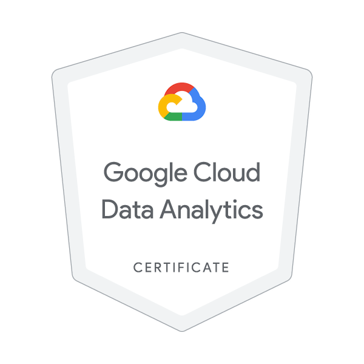
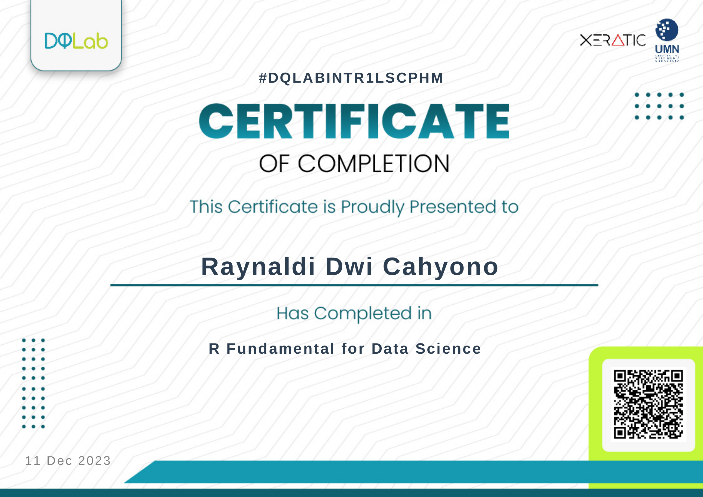
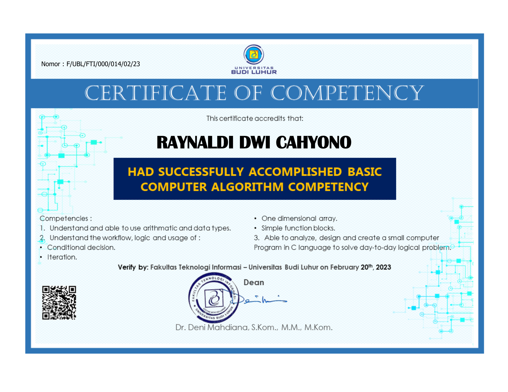
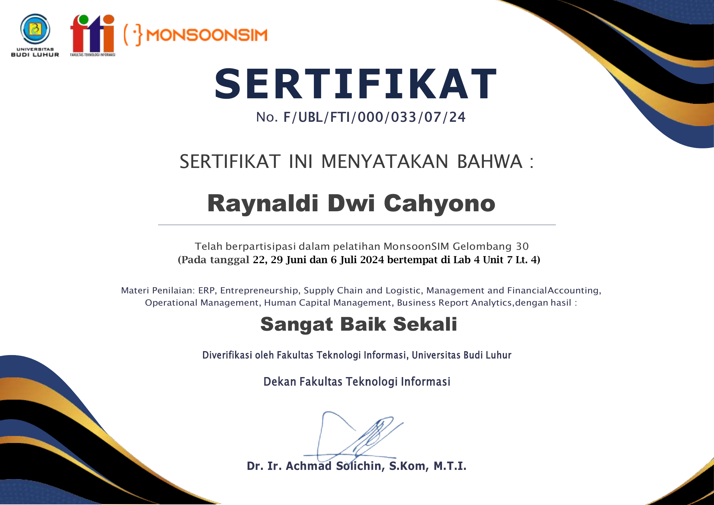
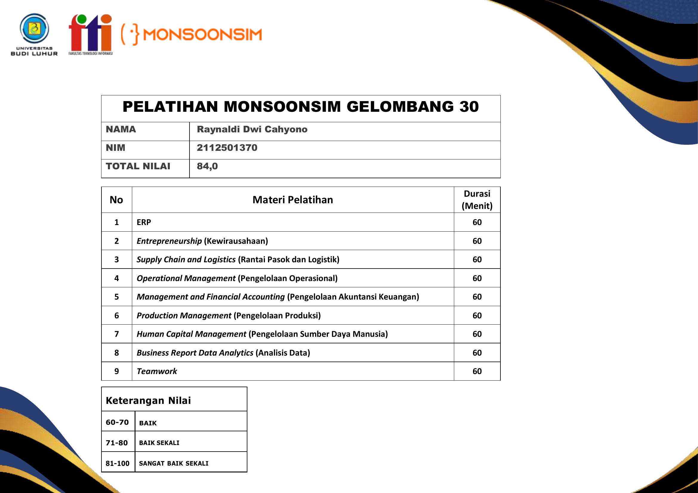
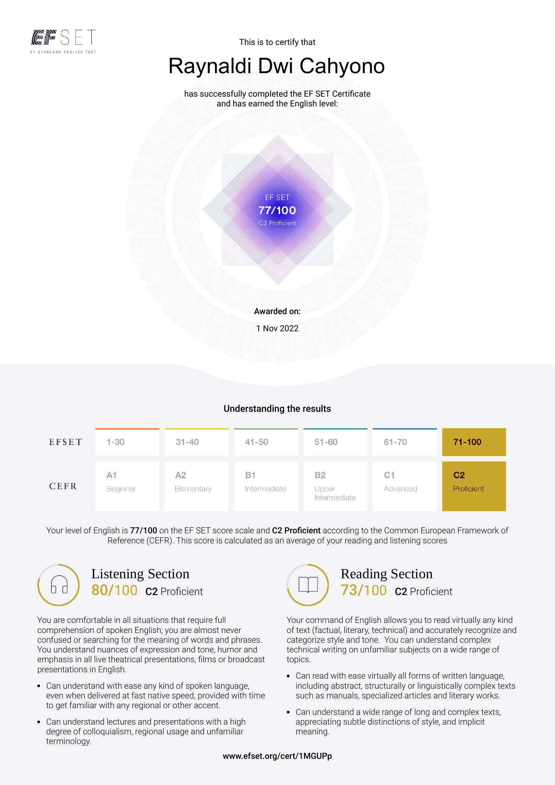

# 📜 Certificates
This repository contains a collection of my certificates that showcase my competencies across various fields. The certificates displayed are obtained from training sessions and examinations. The categories of certificates can be viewed as follows:  
 - Cloud Computing [(click to navigate)](https://github.com/Raynaldi-DC/Certificates?tab=readme-ov-file#cloud-computing)  
 - Python [(click to navigate)](https://github.com/Raynaldi-DC/Certificates?tab=readme-ov-file#python)  
 - R [(click to navigate)](https://github.com/Raynaldi-DC/Certificates?tab=readme-ov-file#r)  
 - SQL [(click to navigate)](https://github.com/Raynaldi-DC/Certificates?tab=readme-ov-file#sql)  
 - Others [(click to navigate)](https://github.com/Raynaldi-DC/Certificates?tab=readme-ov-file#others)

If you would like to see my complete collection of certificates, including those from events and seminars, you can visit this [Google Drive folder](https://drive.google.com/drive/folders/17z1lHjwYIbUeiycSPAZ9ct-hGOag0g8v).

## Cloud Computing
**Google Cloud Data Analytic**  
Issued By : Google  
#Note : This is a digital certificate [(click link for full details)](https://www.credly.com/badges/5f880c70-13ff-4d85-b08a-c43e1ed12d5c/public_url).

 

**Google Cloud Computing**  
Issued By : Google  
#Note : This is a digital certificate [(click link for full details)](https://www.credly.com/badges/5f880c70-13ff-4d85-b08a-c43e1ed12d5c/public_url).

 

## Python
**Python Statistic**  
Issued By : DQLab  
#Note : Consists of 2 parts

 

 

**Python Data Visualization**  
Issued By : DQLab

 

**Python Data Quality**  
Issued By : DQLab

 

**Python Data Science**  
Issued By : DQLab  
#Note : Consists of multiple parts

 

 

 

## R
**R Data Preparation**  
Issued By : DQLab

 

**R Data Visualization**  
Issued By : DQLab  
#Note : Consists of 2 parts

 

 

**R Data Science**  
Issued By : DQLab  
#Note : Consists of 2 parts

 

 

## SQL
**SQL Fundamental**  
Issued By : DQLab

 

## Others
**Data Analysis and Visualization**  
Issued By : Kominfo (Indonesia Ministry of Information and Communication)

 

 

 

**Computer Algorithm**  
Issued By : Budi Luhur University  

 

**MonsoonSIM**  
Issued By : Moonson

 

 

**English**  
Issued By : EF

 

## Navigation
[| Main Menu ](https://github.com/Raynaldi-DC)[| Resume ](https://github.com/Raynaldi-DC/Resume)[| Certificates ](https://github.com/Raynaldi-DC/Certificates)[| Portofolio |](https://github.com/Raynaldi-DC/Portfolio)
